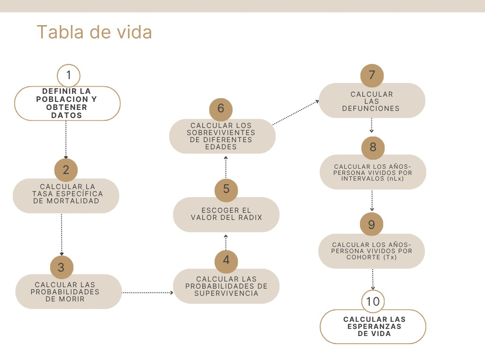

## Tablas de vida del estado de Oaxaca para los años 2010, 2019 y 2021.

## Introducción.

Oaxaca, oficialmente el Estado Libre y Soberano de Oaxaca, es uno de los treinta y un estados que, junto con la Ciudad de México, forman los Estados Unidos Mexicanos. Su capital y ciudad más poblada es Oaxaca de Juárez. Está dividido en 570 municipios, de los cuales 418 se gobiernan bajo el sistema de usos y costumbres, con formas locales reconocidas de autogobierno; agrupados en ocho regiones.

Con 93 757 km², es el quinto estado más extenso y, según en Cuestionario Básico del Censo de Población y Vivienda 2020, se contaron 4 132 148 personas que se distribuyen según sexo en 47.8% hombres y 52.2% mujeres; la relación hombres-mujeres muestra que existen 92 hombres por cada 100 mujeres. Por su número de habitantes ocupa el lugar 10 a nivel nacional, siendo el municipio de Oaxaca de Juárez el más poblado con 270 955 habitantes y el municipio de Santa Magdalena Jicotlán el de menos población con 81 residentes. La edad mediana en la entidad federativa es de 28 años.

Algunos indicadores que podrían estar asociados al comportamiento de la mortalidad son los de violencia, PIB per cápita y de igualdad en el ámbito económico, así como de acceso a servicios de salud. A continuación dichos indicadores:

Seguridad:

En 2024, 33.5% de los hombres mayores de 18 años de Oaxaca percibieron seguridad en su entidad federativa, mientras que 22% de mujeres mayores de 18 años compartieron dicha percepción. A nivel de personas, los hombres del estrato sociodemográfico medio alto percibieron mayor seguridad (40.8%), mientras que las mujeres percibieron mayor seguridad en el estrato socioeconómico bajo (23.3%).

Las denuncias con mayor ocurrencia durante Octubre 2025 fueron Robo (472), Amenazas (320) y Violencia Familiar (285), las cuales abarcaron un 44.8% del total de denuncias del mes. Al comparar el número de denuncias en Octubre 2024 y Octubre 2025, aquellas con mayor crecimiento fueron Otros Delitos que Atentan contra la Libertad y la Seguridad Sexual (200%), Electorales (156%) y Incumplimiento de Obligaciones de Asistencia Familiar (100%).

En lo económico:

En el primer trimestre de 2025, la población económicamente activa de Oaxaca fue de 1.83M personas. La fuerza laboral ocupada alcanzó las 1.8M personas (40.6% mujeres y 59.4% hombres) con un salario promedio mensual de \$4.22k MX. Las ocupaciones que concentran mayor número de trabajadores fueron [**Trabajadores en el Cultivo de Maíz Y/O Frijol**](https://www.economia.gob.mx/es/profile/occupation/6111) (223k), [**Trabajadores de Apoyo en Actividades Agrícolas**](https://www.economia.gob.mx/es/profile/occupation/9111) (148k) y [**Comerciantes en Establecimientos**](https://www.economia.gob.mx/es/profile/occupation/4111) (92.6k). Se registraron 29.9k desempleados (tasa de desempleo de 1.63%).

En la salud:

En Oaxaca, las opciones de atención de salud más utilizadas en 2020 fueron Centro de Salud u Hospital de la SSA (Seguro Popular) (1.9M), Consultorio de farmacia (747k) y IMSS (Seguro social) (551k).

En cuanto a igualdad.

En Oaxaca, el 10% de los hogares de menores ingresos (primer decil) tuvieron un ingreso promedio trimestral de \$8.14k MX en 2022, mientras que el 10% de los hogares de mayores ingresos (décimo decil) tuvieron un ingreso promedio trimestral de \$131k MX en el mismo periodo. El coeficiente o índice de Gini nos dice que índices más cercanos a 0 representan más equidad entre sus habitantes, mientras que valores cercanos a 1 expresan máxima inequidad entre su población. En 2020, en **Oaxaca**, las municipios con menor desigualdad social, de acuerdo al índice de GINI,  fueron: [San José del Peñasco](https://www.economia.gob.mx/es/profile/geo/20167) (0.259), [San Antonio Acutla](https://www.economia.gob.mx/es/profile/geo/20106) (0.265), [Santiago Lachiguiri](https://www.economia.gob.mx/es/profile/geo/20470) (0.267), [San Bartolo Yautepec](https://www.economia.gob.mx/es/profile/geo/20122) (0.268) y [San Nicolás](https://www.economia.gob.mx/es/profile/geo/20289) (0.275). Por otro lado, los municipios con menor igualdad social por esta métrica, fueron: [Santo Domingo Tonaltepec](https://www.economia.gob.mx/es/profile/geo/20521) (0.567), [San Simón Zahuatlán](https://www.economia.gob.mx/es/profile/geo/20352) (0.558), [Santiago Juxtlahuaca](https://www.economia.gob.mx/es/profile/geo/20469) (0.467), [Putla Villa de Guerrero](https://www.economia.gob.mx/es/profile/geo/20073) (0.435) y [Constancia del Rosario](https://www.economia.gob.mx/es/profile/geo/20020) (0.433).

Pobreza:

En 2020, 39.6% de la población se encontraba en situación de pobreza moderada y 24.3% en situación de pobreza extrema. La población vulnerable por carencias sociales alcanzó un 24.1%, mientras que la población vulnerable por ingresos fue de 2.49%. Las principales carencias sociales de Oaxaca en 2020 fueron carencia por acceso a la seguridad social, carencia por acceso a los servicios básicos en la vivienda y carencia por acceso a los servicios de salud.

## Diagrama de flujo.

A continuación se muestra el proceso a seguir para la elaboración de cada tabla de vida en el estado de Oaxaca.

{#fig-diagrama fig-cap="Proceso a seguir para la elaboración de tablas de vida"}

## Fórmulas.

A continuación, se presenta una lista de las fórmulas utilizadas:

```{r}
#| message: false
#| warning: false 

library(tidyverse)
library(readxl)
library(dplyr)
library(tidyr)
library(data.table)
```

**Fórmulas utilizadas:**

Tasa específica de mortalidad

$${}_nm_x=\frac{{}_nD_x}{{}_nN_x}$$

Probabilidad de morir

$${}_nq_x=\frac{n\cdot {}_nm_x}{1+(n-{}_na_x)\cdot {}_nm_x}$$

Probabilidad de sobrevivir

$${}_np_x=1-{}_nq_x$$

Sobrevivientes

$$l_{x+n}=l_x\cdot {}_np_x$$

Defunciones

$${}_nd_x=l_x-l_{x+n}$$

Años-Persona Vividos

$${}_nL_x=(n\cdot l_{x+n})+({}_na_x\cdot {}_nd_x)$$

Años-Persona Acumulados

$$T_x=\sum_{a=x}^{\infty}{}_nL_a$$

Esperanza de vida

$$e_x^0=\frac{T_x}{l_x}$$

## Código.

```{r}

# Importación los datos de defunciones
Defunciones <- fread(
  input = "Datos/defunciones.csv",
  sep = ",",                 
  skip = "Total, Total",     
  header = FALSE,            
  encoding = "Latin-1",      #Le decimos a R que espere la "ñ" y los acentos
  col.names = c("Sexo", "Edad", "2010", "2019", "2021") 
)

# Verificamos
Defunciones
```

```{r}

# 1. Importamos saltándonos las 2 primeras líneas en blanco
Poblacion_bruta <- fread("Datos/poblacion.csv", skip = 2, encoding = "Latin-1")

# 2. La Transformación Maestra
Poblacion_limpia <- Poblacion_bruta |> 
  
  # A. Renombramos la primera columna que tiene un nombre horrible
  rename(Etiqueta = `Etiquetas de fila`) |> 
  
  # B. Creamos la columna 'Sexo'. Detectamos si la fila dice Hombres o Mujeres
  mutate(
    Sexo = case_when(
      Etiqueta == "HOMBRES" ~ "Hombre",
      Etiqueta == "MUJERES" ~ "Mujer",
      TRUE ~ NA_character_
    )
  ) |> 
  
  # C. "Rellenamos hacia abajo" el sexo para que los años hereden la categoría
  fill(Sexo, .direction = "down") |> 
  
  # D. Filtramos para quedarnos solo con las filas de los años (y quitamos los totales)
  filter(Etiqueta %in% c("2010", "2019", "2021")) |> 
  rename(Ano = Etiqueta) |> 
  select(-`Suma de POB_TOTAL`) |> 
  
  # E. DERRETIMIENTO: Pasamos todas las columnas de edades a filas
  pivot_longer(
    cols = starts_with("Suma de POB_"), 
    names_to = "Edad", 
    values_to = "Poblacion"
  ) |> 
  
  # F. LIMPIEZA DE TEXTO: Arreglamos los nombres (ej. "Suma de POB_00_04" -> "0-4")
  mutate(
    Edad = str_remove(Edad, "Suma de POB_"),  # Quitamos el prefijo
    Edad = str_replace(Edad, "_", "-"),       # Cambiamos guion bajo por medio
    Edad = str_replace(Edad, "^0", ""),       # Quitamos el cero a la izquierda inicial
    Edad = str_replace(Edad, "-0", "-"),      # Quitamos el cero después del guion
    Edad = str_replace(Edad, "85-mm", "85 y más") # Renombramos el grupo abierto final
  ) |> 
  
  # G. MOLDEADO: Convertimos los años (2010, 2019, 2021) en columnas
  pivot_wider(
    names_from = Ano,
    names_prefix = "Pob_", # Les ponemos un prefijo para no confundirlos con las defunciones
    values_from = Poblacion
  )

# Verificamos la obra de arte
Poblacion_limpia
```

```{r}

# ==============================================================================
# FASE 1: ARMONIZACIÓN ESTRICTA DE BASES DE DATOS
# ==============================================================================

# 1A. Limpieza de Defunciones
Defunciones_clean <- fread("Datos/defunciones.csv", sep = ",", skip = "Total, Total", 
                           header = FALSE, encoding = "Latin-1", 
                           col.names = c("Sexo", "Edad", "D_2010", "D_2019", "D_2021")) |> 
  filter(!Edad %in% c("Total", "No especificado")) |> 
  mutate(across(starts_with("D_"), parse_number)) |> 
  # Arreglamos nombres para que coincidan (quitamos la palabra "años")
  mutate(Edad = str_remove(Edad, " años"),
         Edad = str_trim(Edad)) |> 
  # MAGIA DEMOGRÁFICA: Unimos menores de 1 y 1-4 en un solo grupo "0-4"
  mutate(Edad = case_when(
    Edad %in% c("Menores de 1 año", "1-4") ~ "0-4",
    TRUE ~ Edad
  )) |> 
  # Agrupamos y sumamos para fusionar los infantes
  group_by(Sexo, Edad) |> 
  summarise(across(starts_with("D_"), sum), .groups = "drop")

# 1B. Limpieza de Población
Poblacion_clean <- fread("Datos/poblacion.csv", skip = 2, encoding = "Latin-1") |> 
  rename(Etiqueta = `Etiquetas de fila`) |> 
  mutate(Sexo = case_when(Etiqueta == "HOMBRES" ~ "Hombre",
                          Etiqueta == "MUJERES" ~ "Mujer",
                          TRUE ~ NA_character_)) |> 
  fill(Sexo, .direction = "down") |> 
  filter(Etiqueta %in% c("2010", "2019", "2021")) |> 
  select(-`Suma de POB_TOTAL`) |> 
  pivot_longer(cols = starts_with("Suma de POB_"), names_to = "Edad", values_to = "Poblacion") |> 
  mutate(
    Edad = str_remove(Edad, "Suma de POB_"),
    Edad = str_replace(Edad, "_", "-"),
    Edad = str_replace(Edad, "^0", ""),
    Edad = str_replace(Edad, "-0", "-"),
    Edad = str_replace(Edad, "85-mm", "85 y más")
  ) |> 
  pivot_wider(names_from = Etiqueta, values_from = Poblacion, names_prefix = "P_")

# 1C. Cruce (Inner Join)
# Ahora unimos ambas tablas. Solo sobrevivirán las filas donde Sexo y Edad sean idénticos
Datos_Maestros <- inner_join(Defunciones_clean, Poblacion_clean, by = c("Sexo", "Edad"))

# Convertimos al formato largo para poder separar por año fácilmente
Datos_Largos <- Datos_Maestros |> 
  pivot_longer(cols = starts_with("D_") | starts_with("P_"),
               names_to = c(".value", "Ano"),
               names_sep = "_") |> 
  # Ordenamos las edades matemáticamente (extraemos el primer número)
  mutate(x_inicio = parse_number(Edad)) |> 
  arrange(Sexo, Ano, x_inicio)


# ==============================================================================
# FASE 2: EL MOTOR ACTUARIAL (FUNCIÓN DE TABLA DE VIDA)
# ==============================================================================

crear_tabla_mortalidad <- function(df) {
  df |> 
    mutate(
      # Amplitud del intervalo (n) - Asumimos 5 para todos, excepto el grupo abierto final
      n = 5,
      
      # Tasa central de mortalidad (mx)
      mx = D / P,
      
      # Factor de separación (ax) - Años promedio vividos por los que mueren en el intervalo (estándar 2.5)
      ax = 2.5,
      
      # Probabilidad de morir (qx): Fórmula de Reed-Merrell o estándar actuarial
      qx = (n * mx) / (1 + (n - ax) * mx),
      
      # Corrección para el último grupo abierto (85 y más) donde la probabilidad de morir es del 100%
      qx = if_else(Edad == "85 y más", 1, qx),
      
      # Probabilidad de sobrevivir (px)
      px = 1 - qx,
      
      # Sobrevivientes a la edad exacta x (lx) - Radix de 100,000
      lx = 100000 * cumprod(c(1, px[-n()])),
      
      # Defunciones en la tabla (dx)
      dx = lx * qx,
      
      # Años persona vividos en el intervalo (Lx)
      Lx = if_else(Edad == "85 y más", lx / mx, n * lead(lx, default = 0) + ax * dx),
      
      # Años persona vividos a partir de la edad x (Tx)
      Tx = rev(cumsum(rev(Lx))),
      
      # Esperanza de vida (ex)
      ex = Tx / lx
    ) |> 
    # Seleccionamos las columnas clásicas de la tabla
    select(Edad, n, mx, qx, px, lx, dx, Lx, Tx, ex)
}

# ==============================================================================
# FASE 3: GENERACIÓN DE LAS 6 TABLAS
# ==============================================================================

# Dividimos los datos en una lista de 6 partes (Hombre-2010, Mujer-2010, etc.)
Lista_Datos <- split(Datos_Largos, list(Datos_Largos$Sexo, Datos_Largos$Ano))

# Aplicamos nuestra función actuarial a las 6 bases de datos usando purrr::map
Tablas_Vida_Oaxaca <- map(Lista_Datos, crear_tabla_mortalidad)

# Ejemplo: Para ver la tabla de Hombres en 2021
# Tablas_Vida_Oaxaca$`Hombre.2021`
```

```{r}
print(Tablas_Vida_Oaxaca$`Mujer.2021`)
```

## Esperanzas de vida.

```{r}
library(knitr) # Librería esencial para dibujar tablas hermosas en PDF

# ==============================================================================
# FASE 4: EXTRACCIÓN Y MAQUETACIÓN DEL CUADRO RESUMEN (e0)
# ==============================================================================

Cuadro_Esperanza_Vida <- bind_rows(Tablas_Vida_Oaxaca, .id = "Categoria") |> 
  
  # 1. Filtramos estrictamente la fila de nacimiento
  filter(Edad == "0-4") |> 
  
  # 2. El ID viene como "Hombre.2010". Lo separamos en dos columnas limpias.
  separate(Categoria, into = c("Sexo", "Ano"), sep = "\\.") |> 
  
  # 3. Seleccionamos solo las variables ejecutivas y redondeamos a 2 decimales
  select(Sexo, Ano, Esperanza_Vida = ex) |> 
  mutate(Esperanza_Vida = round(Esperanza_Vida, 2)) |> 
  
  # 4. Moldeado: Ponemos los años como columnas para facilitar la comparación visual
  pivot_wider(
    names_from = Ano, 
    values_from = Esperanza_Vida
  ) |> 
  
  # 5. Ordenamos para que las mujeres aparezcan arriba (suele ser el estándar al tener mayor e0)
  arrange(desc(Sexo))

# Imprimimos el cuadro con calidad académica
kable(
  Cuadro_Esperanza_Vida, 
  caption = "Esperanza de Vida al Nacer (e0) en Oaxaca por Sexo y Año",
  align = "c" # Centramos el texto en las columnas
)
```

## Gráficas de apoyo.
